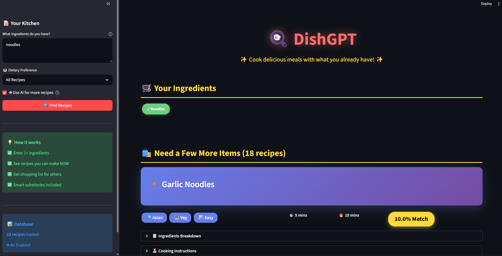

# 🍳 DishGPT - Smart Recipe Builder

**Cook delicious meals with ingredients you already have!**

---

## 🌟 Overview

DishGPT is an AI-powered recipe recommendation system that helps you discover what to cook based on the ingredients you have at home. No more wondering "what can I make with these random ingredients?" - DishGPT has you covered!

### 🎯 Key Features

✅ **Smart Ingredient Matching** - Enter 1 or more ingredients, get instant recipe matches  
✅ **AI-Powered Generation** - Custom recipes created by Google Gemini AI for ANY ingredient combo  
✅ **21 Curated Recipes** - Database of tried-and-tested recipes across multiple cuisines  
✅ **Intelligent Substitutions** - Missing an ingredient? Get smart alternatives  
✅ **Dietary Filters** - Filter by Vegetarian or Non-Vegetarian preferences  
✅ **Beautiful UI** - Modern, responsive design with gradient cards and smooth animations  
✅ **Beginner Friendly** - Clear, step-by-step cooking instructions  

---

## 🖼️ Screenshots

### Main Interface


### Recipe Results


---

## 🚀 Live Demo

**Try it now:** [DishGPT Live App](#) *(https://dishgpt-sumit.streamlit.app/)*

---

## 📊 Recipe Database

DishGPT includes **21 hand-curated recipes** across multiple cuisines:

### 🍗 Non-Vegetarian (9 recipes)
- Chicken Fried Rice (Chinese)
- Simple Chicken Curry (Indian)
- Egg Fried Rice (Asian)
- Omelette (Continental)
- Garlic Butter Chicken (Continental)
- Tomato Scrambled Eggs (Chinese)
- Simple Fried Chicken (Continental)
- Onion Omelette (Indian)
- Rice and Egg Bowl (Asian)

### 🥗 Vegetarian (12 recipes)
- Paneer Butter Masala (Indian)
- Tomato Rice (Indian)
- Pasta Aglio e Olio (Italian)
- Vegetable Stir Fry (Asian)
- Dal Tadka (Indian)
- Potato Fry (Indian)
- Vegetable Rice (Indian)
- Garlic Noodles (Asian)
- Butter Toast (Continental)
- Simple Stir-Fried Noodles (Asian)
- Hakka Noodles (Indo-Chinese)
- Garlic Butter Noodles (Fusion)

**Plus unlimited AI-generated recipes for creative combinations!**

---

## 💡 How It Works

### 1. Enter Your Ingredients
```
Examples:
- chicken, rice, soy sauce
- egg, bread, butter
- noodles, garlic
- peanut butter, banana
```

### 2. Smart Matching Algorithm
- Normalizes ingredient names (handles plurals, typos)
- Calculates match percentage for each recipe
- Prioritizes recipes you can make **RIGHT NOW**
- Separates mandatory vs optional ingredients

### 3. AI Enhancement
- If enabled, Google Gemini generates 2 custom recipes
- Uses your exact ingredients
- Provides detailed cooking steps
- Marked with 🤖 AI badge

### 4. Get Results
- **"Ready to Cook"** section - Recipes with all mandatory ingredients
- **"Need a Few More Items"** section - Close matches with shopping list
- Color-coded ingredient pills:
  - 🟢 Green = You have it
  - 🔴 Red = Must buy (mandatory)
  - 🟡 Yellow = Optional ingredient

---

## 🛠️ Tech Stack

| Component | Technology |
|-----------|-----------|
| **Frontend** | Streamlit |
| **AI Engine** | Google Gemini 1.0 Pro |
| **Language** | Python 3.10+ |
| **Data Storage** | JSON files |
| **Deployment** | Streamlit Cloud |
| **Version Control** | Git & GitHub |

---

## 📁 Project Structure
```
dishgpt/
├── app.py                      # Main Streamlit application
├── requirements.txt            # Python dependencies
├── README.md                   # Project documentation
├── .gitignore                  # Git ignore rules
├── .env                        # Environment variables (local only)
│
├── data/
│   ├── recipes.json           # 21 recipe database
│   └── substitutes.json       # Ingredient substitution rules
│
├── utils/
│   ├── __init__.py            # Package initializer
│   ├── matcher.py             # Recipe matching algorithm
│   ├── ai_helper.py           # AI integration (Gemini)
│   └── normalizer.py          # Ingredient normalization
│
├── screenshots/
│   ├── frontpage.png          # Main UI screenshot
│   └── recipes.png            # Recipe results screenshot
│
└── .streamlit/
    └── secrets.toml           # Deployment secrets (not in repo)
```

---

## 🔧 Installation & Setup

### Prerequisites
- Python 3.10 or higher
- Google Gemini API key (free)

### Local Setup

1. **Clone the repository**
```bash
git clone https://github.com/sumittt2004/DishGPT
cd dishgpt
```

2. **Create virtual environment**
```bash
python -m venv venv
venv\Scripts\activate  # Windows
# or
source venv/bin/activate  # Mac/Linux
```

3. **Install dependencies**
```bash
pip install -r requirements.txt
```

4. **Set up environment variables**

Create a `.env` file in the root directory:
```env
GEMINI_API_KEY=your_api_key_here
```

Get your free API key from: https://aistudio.google.com/app/apikey

5. **Run the app**
```bash
streamlit run app.py
```

The app will open in your browser at `http://localhost:8501`

---

## 🎯 Core Algorithms

### 1. Ingredient Normalization
```python
# Handles variations:
"tomatoes" → "tomato"
"Chicken Breast" → "chicken"
"fresh garlic" → "garlic"
```

### 2. Smart Matching Score
```python
Score = (matched_ingredients / total_ingredients) * 100
+ bonus for all mandatory ingredients met
+ penalty for missing mandatory items
```

### 3. Recipe Prioritization
1. Recipes you can make NOW (all mandatory ingredients)
2. High match percentage (80%+)
3. Fewest additional ingredients needed

---

## 🌟 Usage Examples

### Example 1: Quick Breakfast
**Input:** `egg, bread`  
**Output:**
- ✅ Omelette (100% match - make now!)
- ✅ Butter Toast (needs: butter)

### Example 2: Asian Dinner
**Input:** `noodles, soy sauce, garlic`  
**Output:**
- ✅ Garlic Noodles (100% match)
- 🤖 AI: Soy Garlic Noodle Bowl (custom recipe)

### Example 3: Indian Cuisine
**Input:** `paneer, tomato, cream`  
**Output:**
- ✅ Paneer Butter Masala (needs: butter, spices)

### Example 4: Creative Combo
**Input:** `peanut butter, banana, bread`  
**Output:**
- 🤖 AI: Peanut Butter Banana Toast
- 🤖 AI: Banana PB Sandwich

---

## 🎨 Features in Detail

### Smart Substitutions
If you're missing an ingredient, DishGPT suggests alternatives:
- No soy sauce? → Use tamari or salt
- No butter? → Use ghee or olive oil
- No paneer? → Use tofu or halloumi

### AI Integration
- **Model:** Google Gemini 1.0 Pro
- **Cost:** 100% FREE (generous free tier)
- **Speed:** ~2-3 seconds per generation
- **Quality:** Structured JSON output with validation

### Responsive Design
- Works on desktop, tablet, and mobile
- Dark theme optimized
- Gradient cards with hover effects
- Color-coded ingredient pills

---

## 🔮 Future Enhancements

- [ ] Save favorite recipes
- [ ] Shopping list generator
- [ ] Nutritional information
- [ ] Cooking timer integration
- [ ] User accounts & recipe history
- [ ] Image upload for ingredient recognition
- [ ] Multi-language support
- [ ] Share recipes via link

---

## 🤝 Contributing

Contributions are welcome! Here's how:

1. Fork the repository
2. Create a feature branch (`git checkout -b feature/AmazingFeature`)
3. Commit your changes (`git commit -m 'Add some AmazingFeature'`)
4. Push to the branch (`git push origin feature/AmazingFeature`)
5. Open a Pull Request

---

## 👨‍💻 Author

**Sumit Mishra**
- GitHub: [@sumittt2004](https://github.com/sumittt2004)
- LinkedIn: [Sumit Mishra](https://www.linkedin.com/in/mishra-sumit-/)
- Email: sumitmishra7744@gmail.com

---

## 🙏 Acknowledgments

- **Google Gemini** for AI capabilities
- **Streamlit** for the amazing framework
- **Recipe inspiration** from various cuisines worldwide


---

## 🎉 Quick Start
```bash
# 1. Clone
git clone https://github.com/sumittt2004/DishGPT

# 2. Install
cd dishgpt
pip install -r requirements.txt

# 3. Configure
echo "GEMINI_API_KEY=your_key" > .env

# 4. Run
streamlit run app.py
```

**That's it! Start cooking! 🍳**

---

<div align="center">

### Made with ❤️ and 🤖

**DishGPT** - Never wonder what to cook again!


</div>